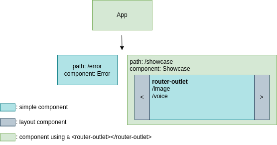

# Frontend

This project was generated with [Angular CLI](https://github.com/angular/angular-cli) version 16.0.1.

## Development policies (**IMPORTANT TO FOLLOW**)

* File naming (and other types of naming): This project generally follows the rules proposed by angular themselves [here](https://angular.io/guide/styleguide#naming), so **please** do give the guidelines a glance, there's reasons for why following a convention and keeping consistency does great work for the team.
* Naming convention for code: camelCase.
* The use of **Route Guards** and **Resolvers** is a must if a route contains any sort of data that is either fetched or passed on by some mean, such as a query url parameter, regular parameter, or from an API.
* **Route Guards** and **Resolvers** should be contained in their own scope, for example a **Guard** that is used globally in different components should be defined in `src/app/guards/`, while the ones that are used exclusively by a component should be defined within their own directory, let's say `src/app/components/card-viewer/` as an example.
* The last point does not only apply to **Guards** and **Resolvers**, interfaces, services, and such other files should follow the same rule.
* Pull requests are encouraged, and quality checking is a must. A codebase is a thing that extends as time goes on, let's keep keep it healthy.

## NPM scripts

```bash
# run in development mode
$ npm run start

# run in production mode
$ npm run start:prod

# build (The build artifacts will be stored in dist/)
$ npm run build

# build as you develop
$ npm run watch

# test execute the unit tests via Karma
$ npm run test
```

---

## Project's layout



### Folder structure

The following is a reduced version of the project's folder structure, it contains the key folders in order to understand more clearly how the application works.

```bash
ai-authentication
└── src
    ├── app
    │   ├── core
    │   │   ├── transient-services
    │   │   └── services
    │   └── pages
    │       ├── showcase
    │       │   └── pages
    │       └── error
    └── abstract-classes
```

* `app/pages`: As the name suggests it holds the pages for our `app-routing.module` routes, inside of it we have our `showcase` folder that in itself also has its own routing module.
* `core`: Folder where both singleton and transient services are defined and used across all components. One thing to note is that transient services are not inlcuded in the core module, but provided in individual components.
> transient services refers to services that are instantiated once by every component that uses them, like so with the providers option:
```typescript
@Component({
    selector: 'app-image',
    templateUrl: './image.component.html',
    styleUrls: ['./image.component.scss'],
    providers: [WebcamService, FaceRecognitionService]
})
export class ImageComponent implements AfterViewInit { ... }
```
* `abstract-classses`: Folder where we store essentially parent classes that contain logic shared on children classes, in angular's case components. Use only for cases where **many** components share the same strict logic, otherwise using abstract classes is not recommended as things can get more complex or tigthly coupled than they need to be (see [composition vs inheritance](https://www.digitalocean.com/community/tutorials/composition-vs-inheritance), where inheritance refers to our abstract class and composition the use of angular services).

---
## Notes

There are some things to take in mind when developing this app, one of them is to avoid unnecessary duplication of logic(code). Below this you will find a list of common solutions that should already exist.

### Error Handling

* `src/app/core/services/error-handler.service`: this service should take care of exceptions generated by HTTP requests sent from the client, for example redirecting the user to the error page with the provided status code.

### Form behaviour

* `src/abstract-classses/form-base.abstract`: this abstract class contains the minimum properties and functions a simple form should have, behaviour like marking all invalid fields as red is included (the html for the forms should be similar to emulate this). 